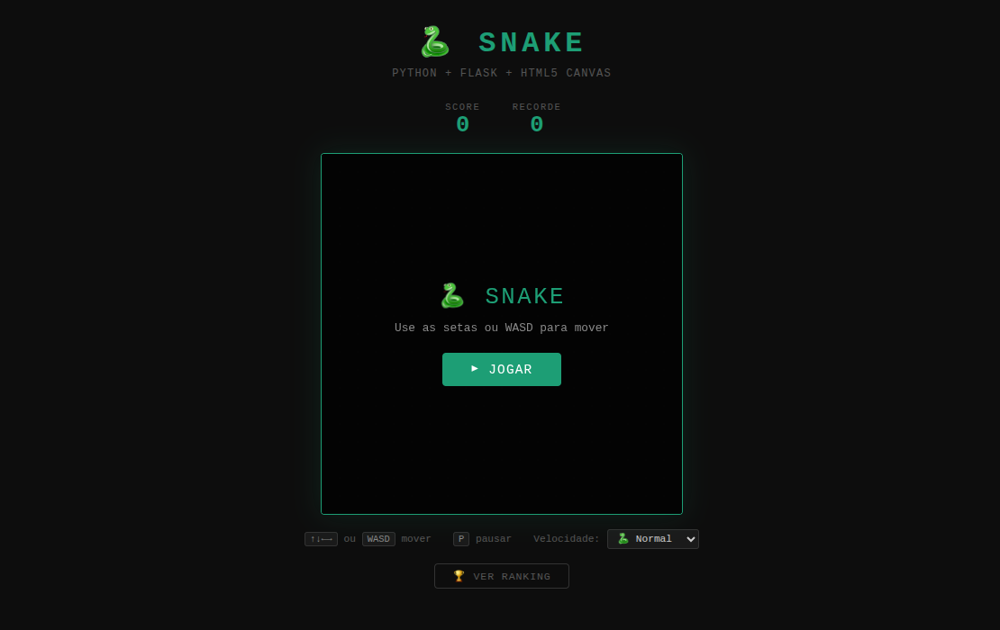

# 🐍 Snake Classic



Snake clássico em HTML5 Canvas, servido por Flask e containerizado.
---

## Rodar com Docker Compose (recomendado)

```bash
docker compose up -d
```

Acesse: http://localhost:8600

---

## Rodar sem Docker (desenvolvimento)

```bash
cd app
pip install -r ../requirements.txt
python main.py
```

Acesse: http://localhost:8080

---

## Controles

| Tecla | Ação |
|-------|------|
| `↑ ↓ ← →` ou `WASD` | Mover a cobra |
| `P` | Pausar / continuar |

Em dispositivos touch: use o D-pad na tela.

---

## Estrutura

```
docker-snake/
├── app/
│   ├── main.py              ← servidor Flask + endpoints
│   ├── templates/
│   │   └── index.html       ← HTML + layout do jogo
│   └── static/
│       └── snake.js         ← lógica do Snake (Canvas API)
├── Dockerfile
├── docker-compose.yml
├── requirements.txt
└── README.md
```

---

## API endpoints

| Endpoint | Método | Descrição |
|----------|--------|-----------|
| `/` | GET | Jogo |
| `/health` | GET | Health check |
| `/scores` | GET | Top 10 pontuações |
| `/scores/<nome>/<pontos>` | POST | Salvar pontuação |

---

## Comandos úteis

```bash
# Build manual
docker build -t docker-snake .

# Rodar manual
docker run -d -p 8600:8080 --name snake docker-snake

# Ver logs
docker compose logs -f

# Parar
docker compose down
```

---

## Ideias para expandir - Vou fazer depois

- ✅ Persistir placar em SQLite com `flask-sqlalchemy`
- ✅ Adicionar tela de ranking com nomes
- Modo multiplayer com WebSockets (`flask-socketio`)
- Temas de cor diferentes
- Power-ups no mapa
